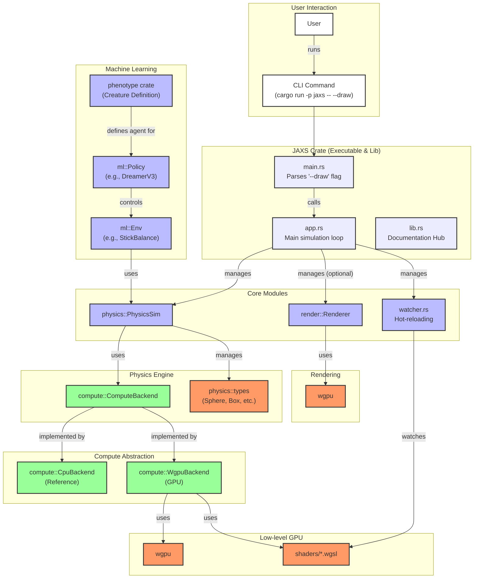

# JAXS Project Architecture

This document provides a visual overview of the JAXS project architecture, showing how the different crates and components interact with each other.

```mermaid
graph TD
    subgraph "User Interaction"
        direction LR
        User -- "runs" --> CLI;
        CLI["CLI Command<br/>(cargo run -p jaxs -- --draw)"];
    end

    subgraph "JAXS Crate (Executable & Lib)"
        direction TB
        CLI --> jaxs_main["main.rs<br/>Parses '--draw' flag"];
        jaxs_main -- "calls" --> jaxs_app["app.rs<br/>Main simulation loop"];
        jaxs_lib["lib.rs<br/>Documentation Hub"];
    end

    subgraph "Core Modules"
        direction TB
        jaxs_app -- "manages" --> physics_sim["physics::PhysicsSim"];
        jaxs_app -- "manages (optional)" --> render_renderer["render::Renderer"];
        jaxs_app -- "manages" --> watcher["watcher.rs<br/>Hot-reloading"];
    end

    subgraph "Physics Engine"
        physics_sim -- "uses" --> compute_backend["compute::ComputeBackend"];
        physics_sim -- "manages" --> physics_types["physics::types<br/>(Sphere, Box, etc.)"];
    end

    subgraph "Compute Abstraction"
        direction LR
        compute_backend -- "implemented by" --> cpu_backend["compute::CpuBackend<br/>(Reference)"];
        compute_backend -- "implemented by" --> gpu_backend["compute::WgpuBackend<br/>(GPU)"];
    end

    subgraph "Rendering"
        render_renderer -- "uses" --> wgpu1["wgpu"];
    end
    
    subgraph "Low-level GPU"
       gpu_backend -- "uses" --> wgpu2["wgpu"];
       gpu_backend -- "uses" --> wgsl["shaders/*.wgsl"];
       watcher -- "watches" --> wgsl;
    end
    
    subgraph "Machine Learning"
        direction TB
        ml_env["ml::Env<br/>(e.g., StickBalance)"] -- "uses" --> physics_sim;
        ml_policy["ml::Policy<br/>(e.g., DreamerV3)"] -- "controls" --> ml_env;
        phenotype["phenotype crate<br/>(Creature Definition)"] -- "defines agent for" --> ml_policy;
    end

    %% Styling
    classDef user fill:#fff,stroke:#333,stroke-width:2px;
    classDef jaxs crate fill:#f9f,stroke:#333,stroke-width:2px;
    classDef core fill:#bbf,stroke:#333,stroke-width:2px;
    classDef backend fill:#9f9,stroke:#333,stroke-width:2px;
    classDef lowlevel fill:#f96,stroke:#333,stroke-width:2px;

    class CLI,User user;
    class jaxs_main,jaxs_app,jaxs_lib jaxs;
    class physics_sim,render_renderer,watcher,ml_env,ml_policy,phenotype core;
    class compute_backend,cpu_backend,gpu_backend backend;
    class wgpu1,wgpu2,wgsl,physics_types lowlevel;
``` 